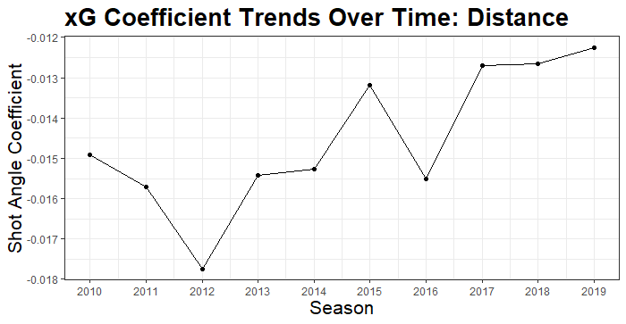
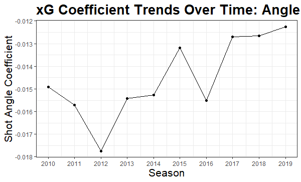

```{r setup, include=FALSE}
options(htmltools.dir.version = FALSE)
knitr::opts_chunk$set(
    fig.retina = 3,
    out.width = "100%",
    cache = FALSE,
    echo = FALSE,
    message = FALSE,
    warning = FALSE,
    fig.show = TRUE,
    hiline = TRUE)
```

```{r xaringan-themer, include = FALSE, warning = FALSE}
library(xaringanthemer)
style_mono_accent(base_color = "#808080",
  white_color = "#FFFFFF",
  background_color = "#fff7e6",
  base_font_size = "24px"
)
```


```{r include = FALSE, warning = FALSE}
# for setting up data
library(tidyverse)
library(dplyr)
library(ggplot2)
library(data.table)

shots <- read_csv("shots_2020.csv")
#shots2020 <- read_csv("shots_data/shots_2020.csv")
#shots0719 <- read.csv("shots_data/shots_2007-2019.csv")

shots <- read.csv("shots_2019.csv")


```


## Problems

  - Assessing accuracy of MoneyPuck expected goals model
  
  - How well can shot angle and shot distance predict goals
  
<<<<<<< HEAD
  - What effect does distance and angle have on the xGoals model change over time?
=======
  - Does the effect distance and angle have on the xGoals model change over time?
>>>>>>> dc05603669467a3081ca50aeff313824c6be7982


---

## Data

  - Using shot data from MoneyPuck
  
  - Variables of interest are shot angle and shot distance
<<<<<<< HEAD
```{r echo=FALSE, fig.align='center', out.width= "10%", out.height="10%" }
data <- shots %>%
    select(season, homeTeamCode, awayTeamCode, goal, arenaAdjustedShotDistance,
           shotAngleAdjusted, shooterName, goalieNameForShot)
library(knitr)
library(kableExtra)
kable(head(data), caption = "2019 Shots Data")
```
=======
  
```{r echo=FALSE}

data <- shots %>%
    select(season, homeTeamCode, awayTeamCode, goal, arenaAdjustedShotDistance,
           shotAngleAdjusted, shooterName, goalieNameForShot)

library(knitr)
library(kableExtra)
>>>>>>> dc05603669467a3081ca50aeff313824c6be7982

kable(head(data), caption = "2020 Shots Data")

```
---
## Moneypuck xGoals Calibration


---

## Rink Cablibration (Detroit)


---

## Rink Calibration (Chicago)


---

## Rink Calibration (Vegas)


---

## Even Strength Calibration


---

## Powerplay Calibration


---

## Penalty Kill Calbration


---

## Shot Distance Trends with Error Bars From 2010-2020


<<<<<<< HEAD
=======


>>>>>>> dc05603669467a3081ca50aeff313824c6be7982

---

## Shot Distance Trends 5 on 5 with Error Bars from 2010-2020


---


## Shot Angle Trends From 2010-2020 with Error Bars


---
## Shot Angle Trends 5 on 5 From 2010-2020


---
## Bootstrapping

- Method of resampling with replacement
- Comparing bootstrap sample coefficient trends to model trends

---
## Bootstrap Distance Coefficient Trends From 2010-2019


---

BootStrap Angle Coefficient Trends From 2010-2019


---
## Discussion

- Recap main points

- Limitations

<<<<<<< HEAD
- Next steps
=======


---
## Bootstrapping

- Brief description of methodology and why we wanted to use bootstrapping

---
## Discussion

- Recap main points
>>>>>>> dc05603669467a3081ca50aeff313824c6be7982

- Limitations

- Next steps


