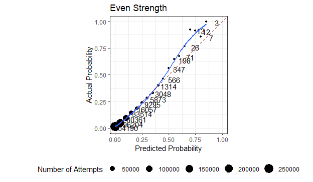
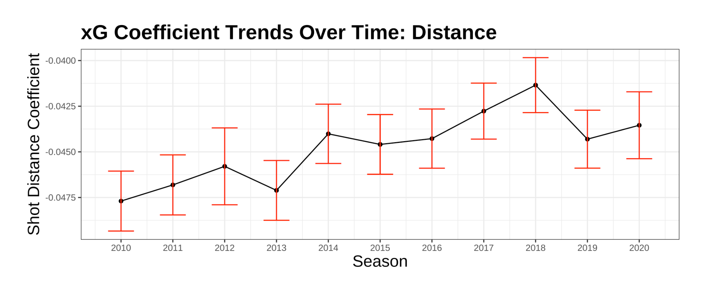

```{r setup, include=FALSE}
options(htmltools.dir.version = FALSE)
knitr::opts_chunk$set(
    fig.retina = 3,
    out.width = "100%",
    cache = FALSE,
    echo = FALSE,
    message = FALSE,
    warning = FALSE,
    fig.show = TRUE,
    hiline = TRUE)
```

```{r xaringan-themer, include = FALSE, warning = FALSE}
library(xaringanthemer)
style_mono_accent(base_color = "#808080",
  white_color = "#FFFFFF",
  background_color = "#fff7e6",
  base_font_size = "24px"
)
```


```{r include = FALSE, warning = FALSE}
# for setting up data
library(tidyverse)
library(dplyr)
library(ggplot2)
library(data.table)
#shots <- read_csv("shots_data/shots_2020.csv")
#shots2020 <- read_csv("shots_data/shots_2020.csv")
#shots0719 <- read.csv("shots_data/shots_2007-2019.csv")


```


## Problems

  - How well can shot angle and shot distance predict goals
  - How accurate is MoneyPuck expected goals model?
  - 


---

## Data

  - Data is from MoneyPuck
  - Variables of interest are shot angle and shot distance


---
## Moneypuck xGoals Calibration


---

## Rink Calibration (Buffalo)


---

## Rink Cablibration (Detroit)


---

## Rink Calibration (Chicago)


---

## Rink Calibration (Vegas)


---

## Even Strength Calibration


---

## Powerplay Calibration


---

## Penalty Kill Calbration


---
## Wristshot Calibration


---
## Shot Distance with Error Bars


---
## Shot Angle Trends with Error Bars


