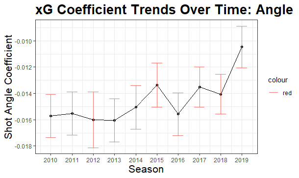

```{r setup, include=FALSE}
options(htmltools.dir.version = FALSE)
knitr::opts_chunk$set(
    fig.retina = 3,
    out.width = "100%",
    cache = FALSE,
    echo = FALSE,
    message = FALSE,
    warning = FALSE,
    fig.show = TRUE,
    hiline = TRUE)
```

```{r xaringan-themer, include = FALSE, warning = FALSE}
library(xaringanthemer)
style_mono_accent(base_color = "#808080",
  white_color = "#FFFFFF",
  background_color = "#fff7e6",
  base_font_size = "24px"
)
```


```{r include = FALSE, warning = FALSE}
# for setting up data
library(tidyverse)
library(dplyr)
library(ggplot2)
library(data.table)

shots <- read_csv("shots_2020.csv")
#shots2020 <- read_csv("shots_data/shots_2020.csv")
#shots0719 <- read.csv("shots_data/shots_2007-2019.csv")

#shots_19 <- read.csv("shots_2019.csv")


```


## Problems

  - Assessing accuracy of MoneyPuck expected goals model
  
  - How well can shot angle and shot distance predict goals

  - Does the effect distance and angle have on the xGoals model change over time?

---

## Data

  - Using shot data from MoneyPuck
  
  - Variables of interest are shot angle and shot distance

```{r echo=FALSE, fig.align = 'center', out.width= "0.5%", out.height= ".1%" }
data <- shots %>%
    select(season, arenaAdjustedShotDistance, shotAngleAdjusted, goal, xGoal)
#library(knitr)
#library(kableExtra)
#kable(head(data[, 1:8]), caption = "2020 Shots Data")

library(gt)
data %>%
  slice(1:5) %>%
  gt()


```


---
## Moneypuck xGoals Calibration


---

## Rink Calibration (Detroit)


---

## Rink Calibration (Chicago)


---

## Rink Calibration (Vegas)


---

## Even Strength Calibration


---

## Powerplay Calibration


---

## Penalty Kill Calibration


---

## Shot Distance Trends with Error Bars From 2010-2020


---


## Shot Distance Trends 5 on 5 with Error Bars from 2010-2020


---


## Shot Angle Trends From 2010-2020 with Error Bars


---
## Shot Angle Trends 5 on 5 From 2010-2020


---
## Bootstrapping

- Method of re sampling with replacement
- Comparing bootstrap sample coefficient trends to model trends
- Limit uncertainty for coefficient trends over time

---
## Bootstrap Distance Coefficient Trends From 2010-2019


---

## Bootstrap Angle Coefficient Trends From 2010-2019




---
## Discussion

- Looked at how well calibrated MoneyPuck's xGoals model is for different conditions

- Looked at coefficient trends over the past 10 seasons

- Limitations
--
  -Data involves shortened seasons (i.e 2012-13, 2019-20, 2020-21)


- What's next
--
 - Adding player age and goalie age as predictor variables to our model


